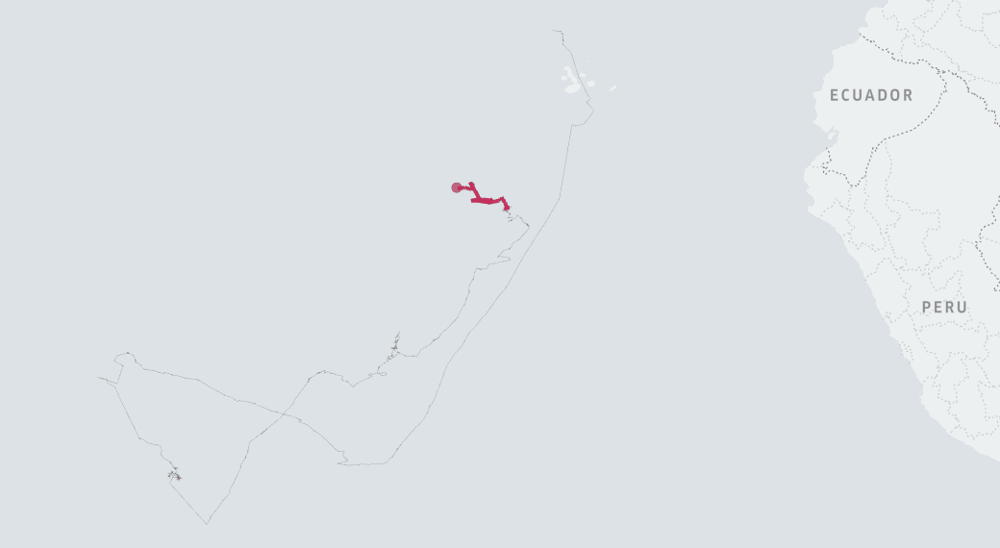
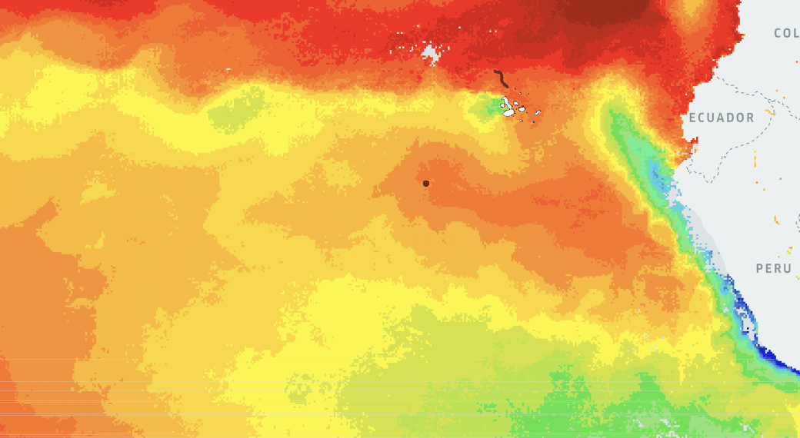
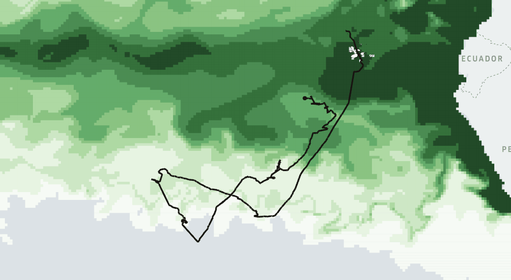
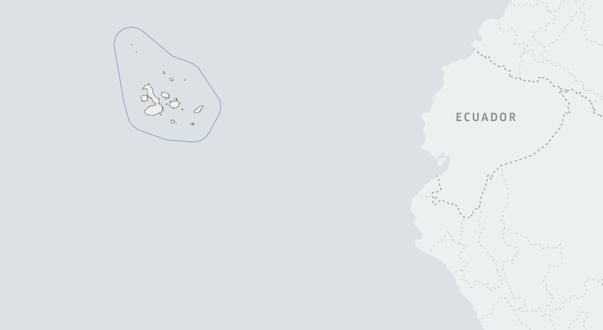
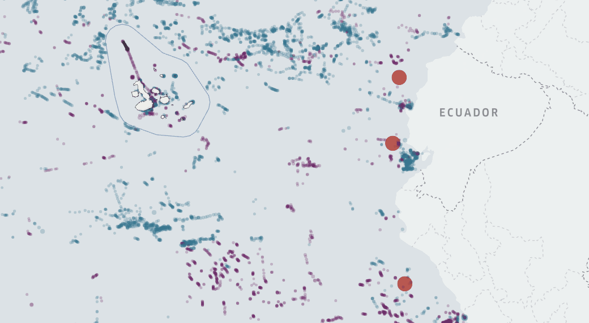

To cite this material

# gallery-v0.3
Gallery dedicated to [Galapagos Whale Shark Project](https://www.gis4-wildlife.com/galapagos-whale-shark-project)

## Galapagos Whale Shark Project

#### Citation

Bryan R. Vallejo, & Sofia Green. (2022). Ocean satellite data implementation in Wildlife Tracker v0.3: eco-geographical variables and fishing pressure tested with Galapagos Whale Shark Project (WildlifeTracker0.3). Zenodo. https://doi.org/10.5281/zenodo.6477841
